## EPIC 1: User Authentication and Account Management
**Description**: Implement secure authentication system and user profile management

### User Story 1.1: User Registration

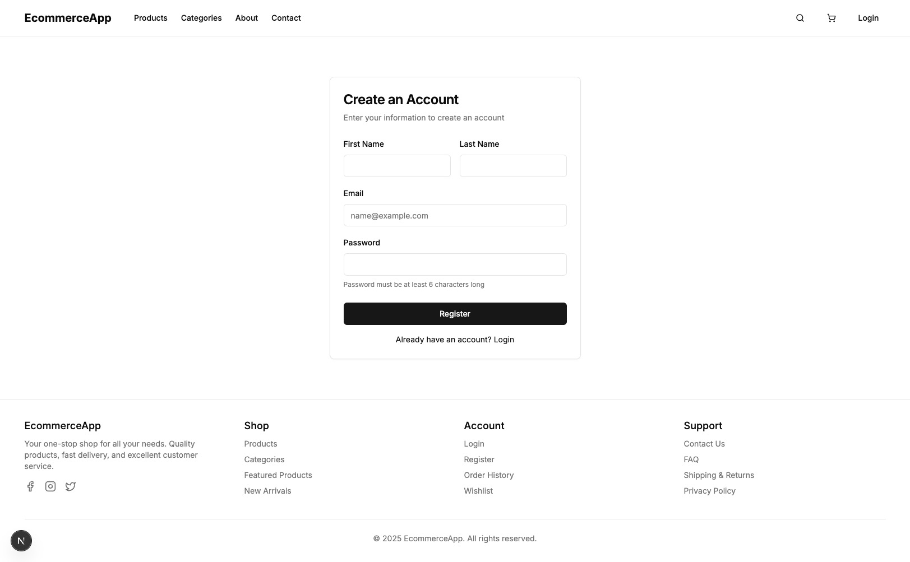

**Title**: Implement user registration functionality

**Description**: As a customer, I want to create an account so that I can save my shopping preferences and track orders.

**Acceptance Criteria**:
- Registration form with email, password, name fields
- Email verification process
- Password strength requirements
- Success/error notifications

> **Estimation**: 3 points

---

### User Story 1.2: User Login

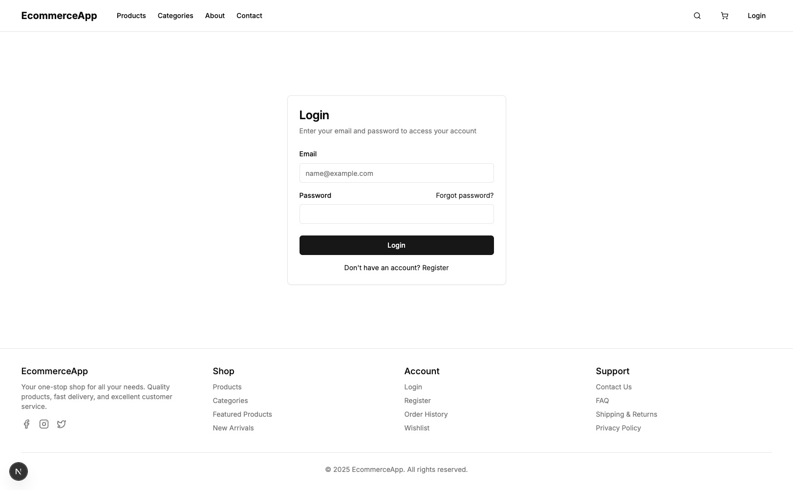

**Title**: Implement user login functionality

**Description**: As a registered user, I want to securely log into my account to access personalized features.

**Acceptance Criteria**:
- Login form with email/password
- Remember me option
- Proper error handling for invalid credentials
- Secure session management

> **Estimation**: 2 points

---

### User Story 1.3: Profile Management

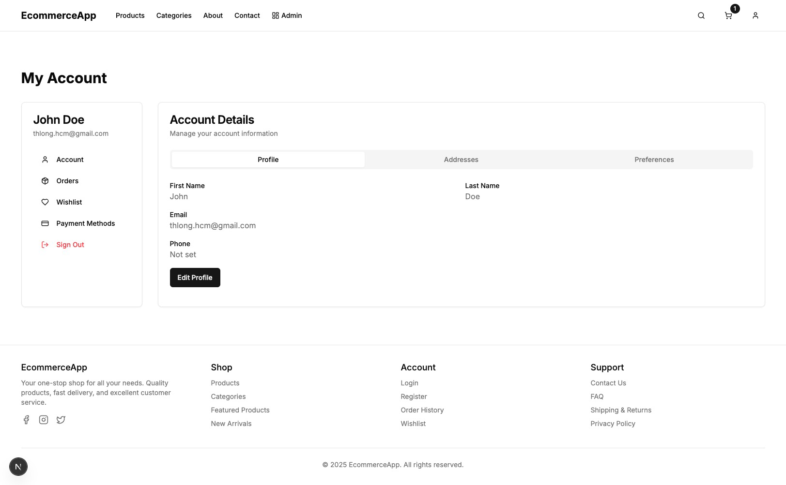

**Title**: Create user profile management

**Description**: As a registered user, I want to view and edit my profile information to keep it up to date.

**Acceptance Criteria**:
- Profile page with user details
- Form to update personal information
- Password change functionality
- Address book management

> **Estimation**: 3 points

---

### User Story 1.4: Password Recovery

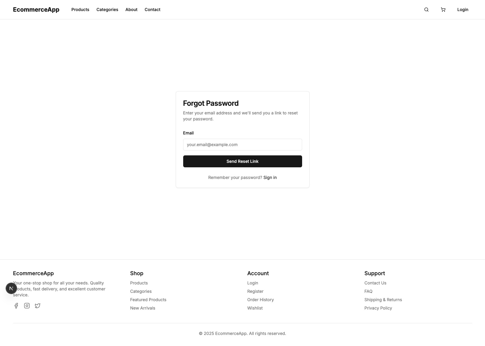

**Title**: Implement password recovery system

**Description**: As a user, I want to reset my password if I forget it so that I can regain access to my account.

**Acceptance Criteria**:
- Forgot password form
- Email with reset link
- Secure reset token handling
- Password reset form with validation

> **Estimation**: 3 points

---

## EPIC 2: Product Catalog and Browsing
**Description**: Create comprehensive product browsing experience with categories and search

### User Story 2.1: Product Listing Page

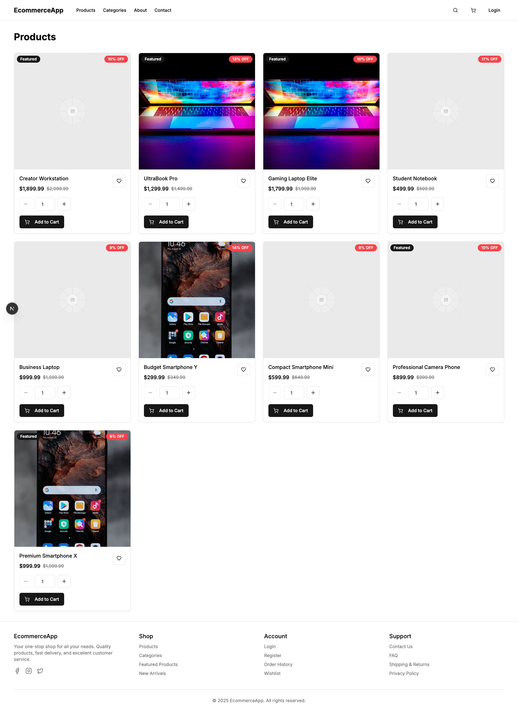

**Title**: Implement product listing with filtering and sorting

**Description**: As a customer, I want to browse products with filtering and sorting options to find items easily.

**Acceptance Criteria**:
- Grid and list view options
- Pagination controls
- Sort by price, popularity, newest
- Filter by price range, category, attributes
- Loading states and empty states

> **Estimation**: 5 points

---

### User Story 2.2: Product Details Page

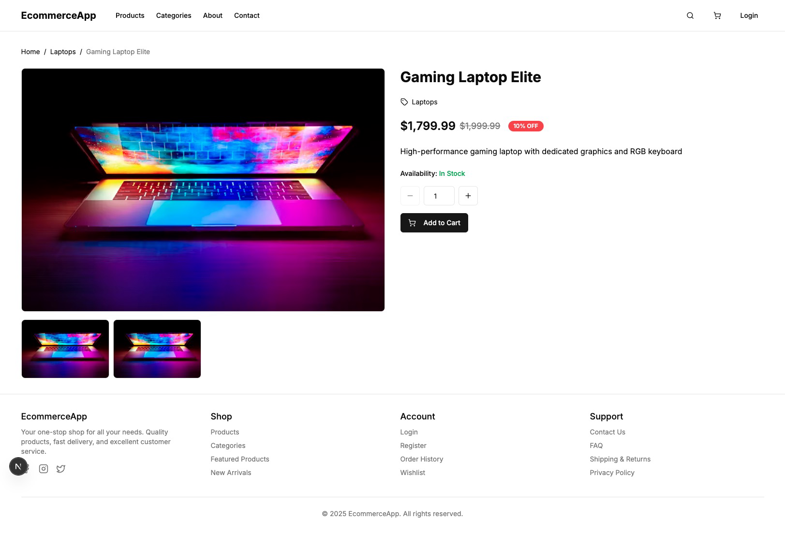

**Title**: Create detailed product view

**Description**: As a customer, I want to see detailed information about products to make informed purchase decisions.

**Acceptance Criteria**:
- Multiple product images with gallery view
- Complete product information
- Add to cart functionality

> **Estimation**: 5 points

---

### User Story 2.3: Category Navigation

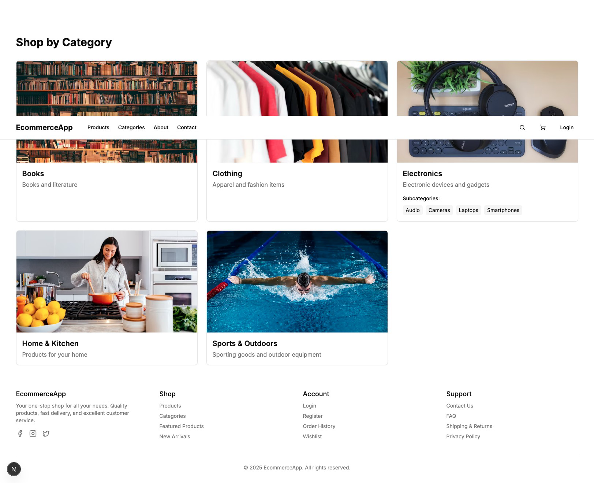

**Title**: Implement category browsing functionality

**Description**: As a customer, I want to navigate through product categories and subcategories to find products.

**Acceptance Criteria**:
- Hierarchical category structure
- Category listing page
- Category-specific product pages

> **Estimation**: 3 points

---

### User Story 2.4: Search Functionality

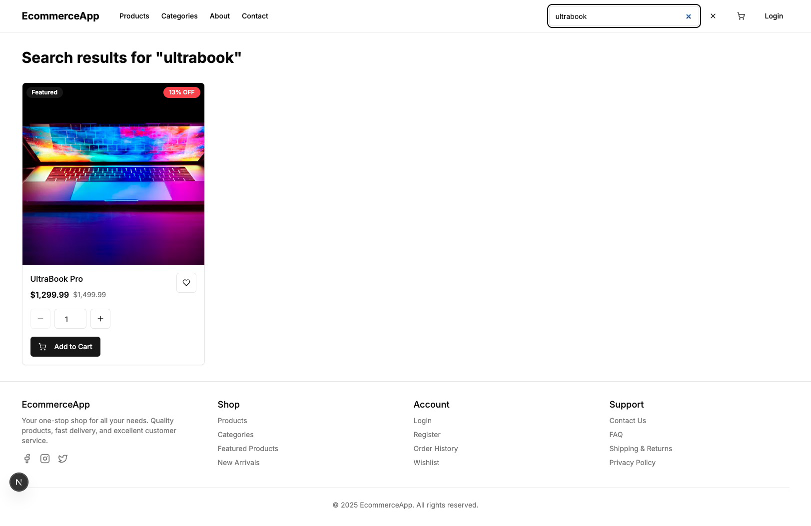

**Title**: Create product search system

**Description**: As a customer, I want to search for products by name, description, or keywords.

**Acceptance Criteria**:
- Search bar in header
- Search results page with filtering options
- Highlighting search terms in results
- Search suggestions
- No results handling

> **Estimation**: 5 points

---

### User Story 2.5: Featured Products

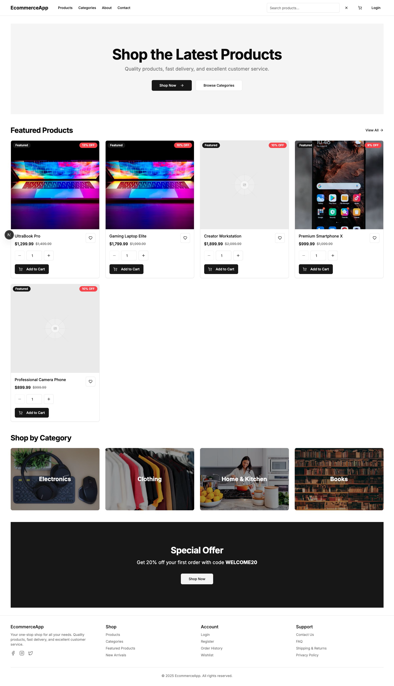

**Title**: Implement featured products on homepage

**Description**: As a store owner, I want to highlight specific products on the homepage to increase visibility.

**Acceptance Criteria**:
- Featured product carousel/grid on homepage
- Admin interface to select featured products
- Responsive design for all screen sizes

> **Estimation**: 2 points

---

## EPIC 3: Shopping Cart and Checkout
**Description**: Implement shopping cart management and secure checkout process

### User Story 3.1: Add to Cart Functionality

**Title**: Create add to cart system

**Description**: As a customer, I want to add products to my cart so I can prepare to purchase them.

**Acceptance Criteria**:
- Add to cart button on product pages and listings
- Quantity selection
- Success notification
- Cart icon update with count
- Inventory validation

> **Estimation**: 3 points

---

### User Story 3.2: Cart Management

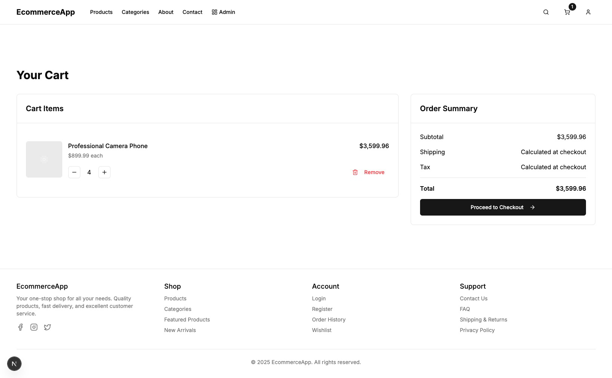

**Title**: Implement shopping cart page

**Description**: As a customer, I want to see all items in my cart, modify quantities, and remove items.

**Acceptance Criteria**:
- List of cart items with images and details
- Quantity adjustment controls
- Remove item buttons
- Price calculations (subtotal, tax estimates)
- Empty cart state

> **Estimation**: 5 points

---

### User Story 3.3: Checkout Process

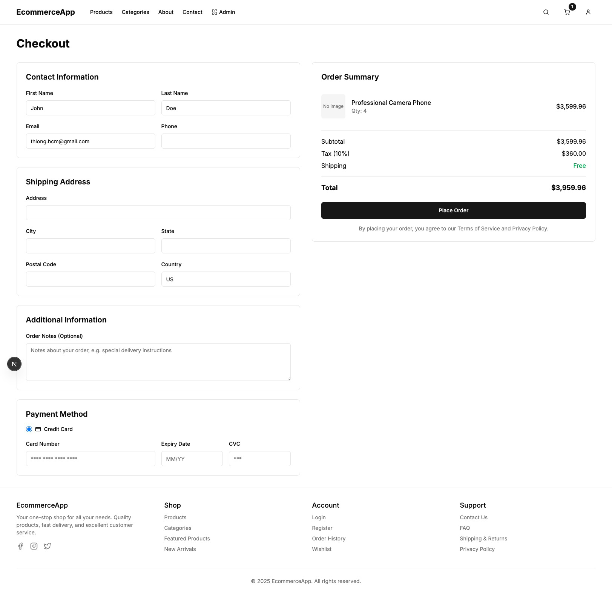

**Title**: Create multi-step checkout process

**Description**: As a customer, I want a clear checkout process to complete my purchase efficiently.

**Acceptance Criteria**:
- Multi-step checkout (shipping, billing, review)
- Guest checkout option
- Address form with validation
- Order summary throughout process
- Breadcrumb navigation between steps

> **Estimation**: 5 points

---

### User Story 3.6: Order Confirmation

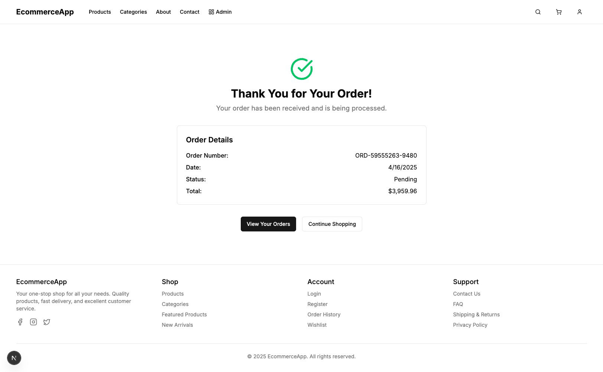

**Title**: Implement order confirmation process

**Description**: As a customer, I want confirmation of my order with details after checkout.

**Acceptance Criteria**:
- Order confirmation page with details
- Email confirmation
- Order tracking link
- Continue shopping button

> **Estimation**: 2 points

---

## EPIC 4: Admin Product Management
**Description**: Create comprehensive product management for store administrators

### User Story 4.1: Product CRUD 

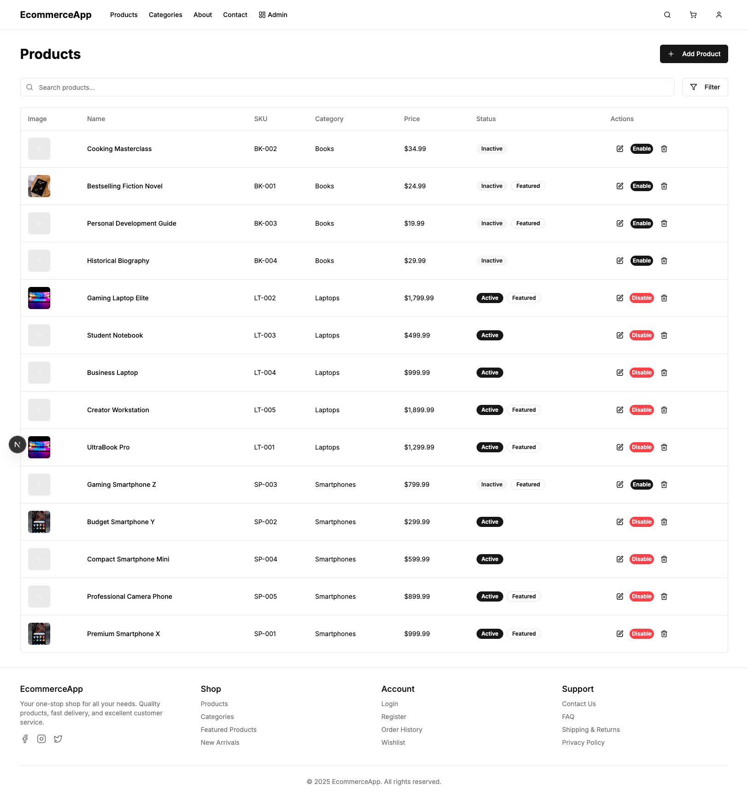

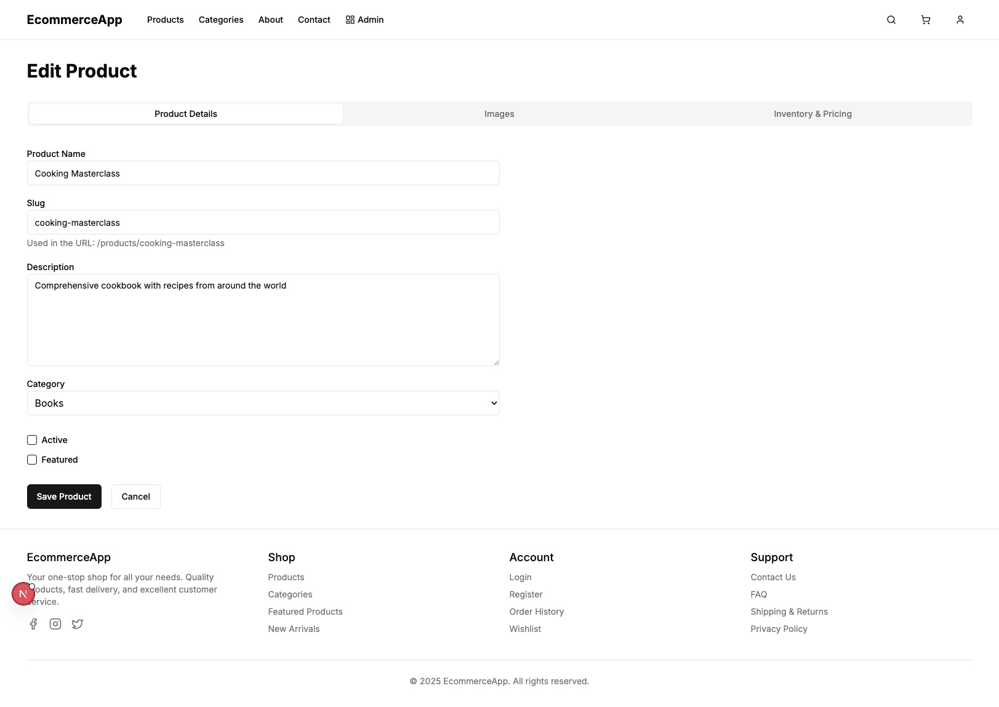

**Title**: Implement product creation, reading, updating, and deletion

**Description**: As an admin, I want to manage product listings to keep the catalog up to date.

**Acceptance Criteria**:
- Product listing page with filtering and sorting
- Add new product form with validation
- Edit product form pre-filled with existing data
- Delete product with confirmation
- Bulk actions for multiple products

> **Estimation**: 5 points

---

### User Story 4.2: Product Image Management

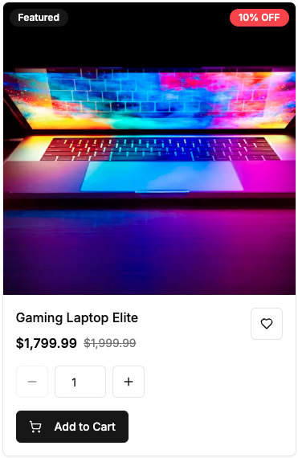

**Title**: Create product image upload and management

**Description**: As an admin, I want to upload and manage multiple images for each product.

**Acceptance Criteria**:
- Multiple image upload interface
- Image preview and reordering
- Primary image selection
- Delete image functionality
- Image optimization handling

> **Estimation**: 5 points

---

### User Story 4.3: Inventory Management

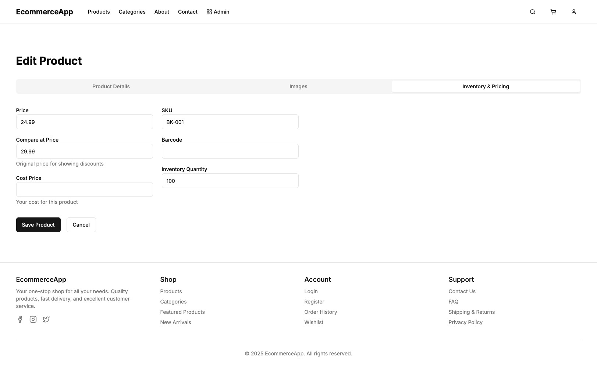

**Title**: Implement inventory tracking system

**Description**: As an admin, I want to track product inventory levels and receive alerts for low stock.

**Acceptance Criteria**:
- Inventory fields in product form
- SKU management
- Low stock threshold settings
- Inventory history logging
- Out of stock handling for front-end

> **Estimation**: 5 points

---

## EPIC 5: Admin Category Management
**Description**: Implement hierarchical category management system

### User Story 5.1: Category CRUD

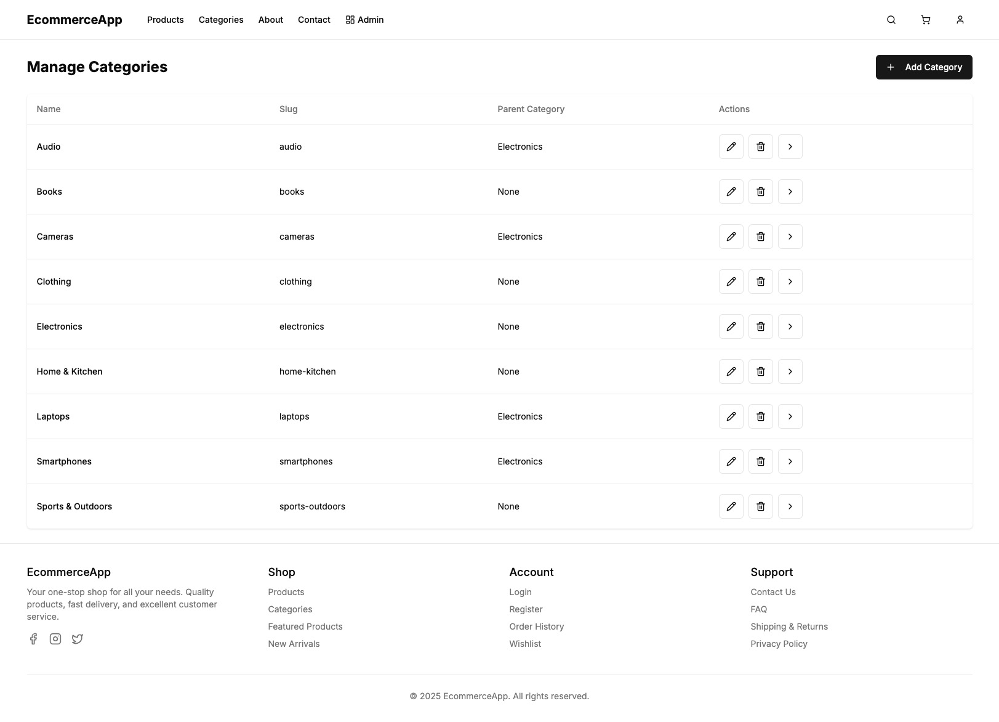

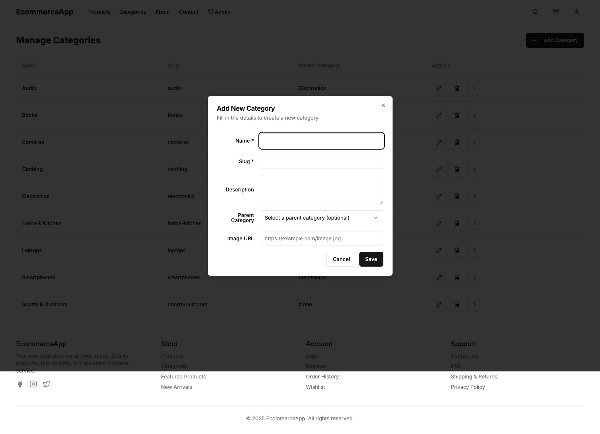

**Title**: Create category management functionality

**Description**: As an admin, I want to create, update, and delete product categories to organize the catalog effectively.

**Acceptance Criteria**:
- Category listing with hierarchical view
- Add new category form with parent selection
- Edit category form
- Delete category with validation for associated products
- Reordering of categories

> **Estimation**: 5 points

---

### User Story 5.2: Hierarchical Category Structure

**Title**: Implement nested category system

**Description**: As an admin, I want to organize categories in a hierarchical structure with main categories and subcategories.

**Acceptance Criteria**:
- Visual representation of category hierarchy
- Ability to nest categories up to 3 levels
- Parent-child relationship management
- Validation to prevent circular references

> **Estimation**: 5 points

---

### User Story 5.3: Category Image Management

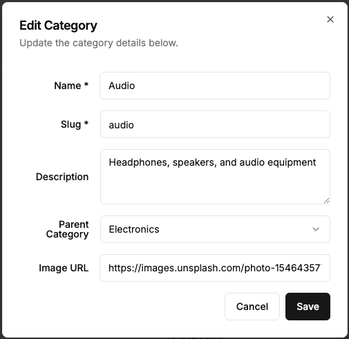

**Title**: Add category image setup functionality

**Description**: As an admin, I want to add images to categories for better visual representation.

**Acceptance Criteria**:
- Image setup for categories
- Image preview
- Default image for categories without custom images

> **Estimation**: 2 points

---

## EPIC 6: Order Management
**Description**: Create comprehensive order management system for administrators

### User Story 6.1: Order Listing and Filtering

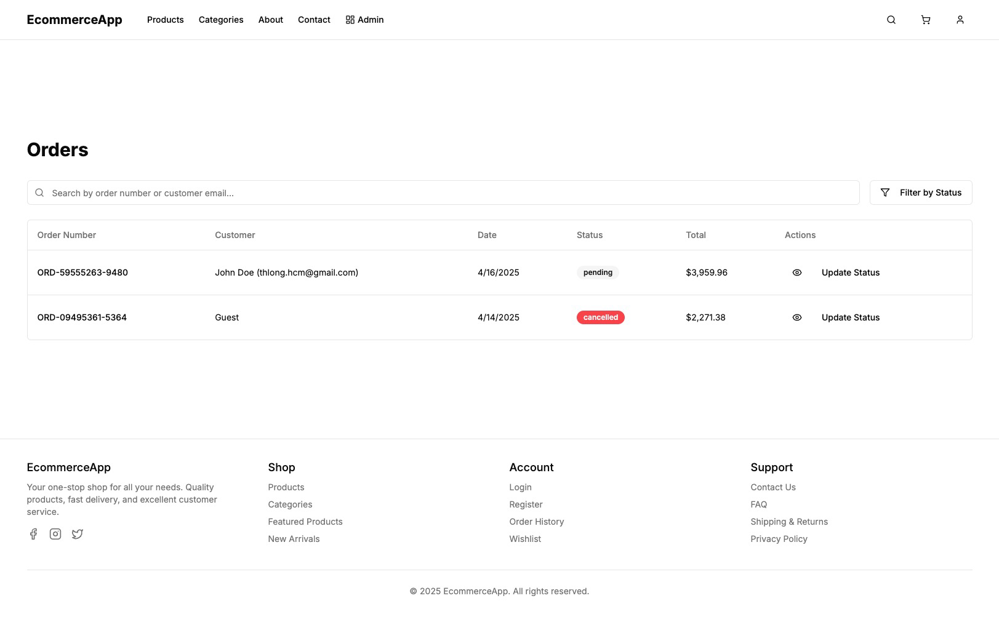

**Title**: Implement order list with advanced filtering

**Description**: As an admin, I want to view and filter all orders to efficiently manage customer purchases.

**Acceptance Criteria**:
- Order list with key details
- Filtering by date, status, customer, amount
- Sorting options
- Pagination for large order volumes

> **Estimation**: 3 points

---

### User Story 6.2: Order Details View

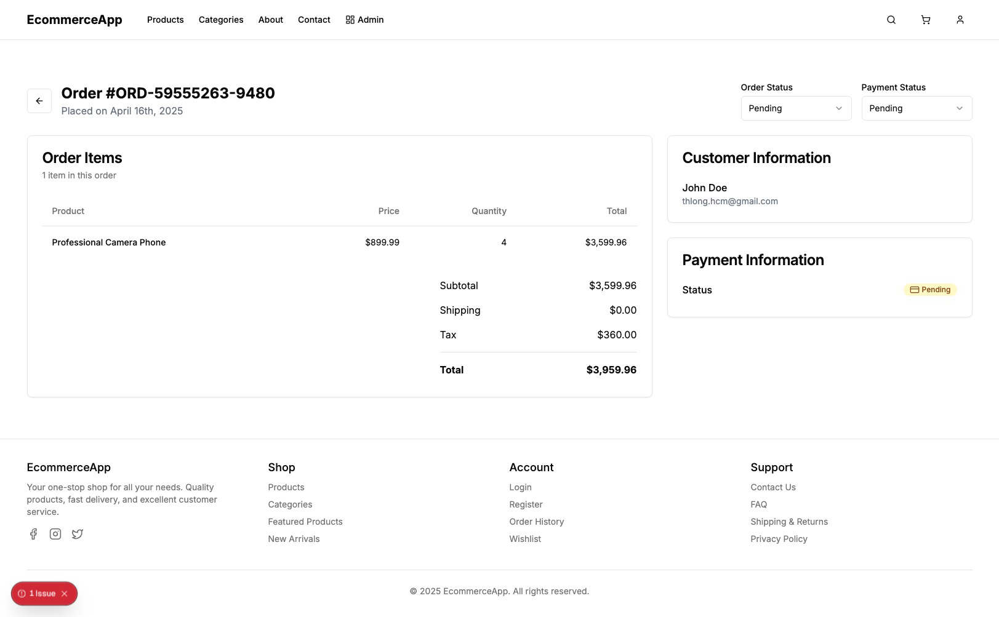

**Title**: Create detailed order view

**Description**: As an admin, I want to see complete order details to process orders correctly.

**Acceptance Criteria**:
- Customer information
- Complete list of ordered items
- Payment information
- Shipping details
- Order notes
- Order history log

> **Estimation**: 5 points

---

### User Story 6.3: Order Status Management

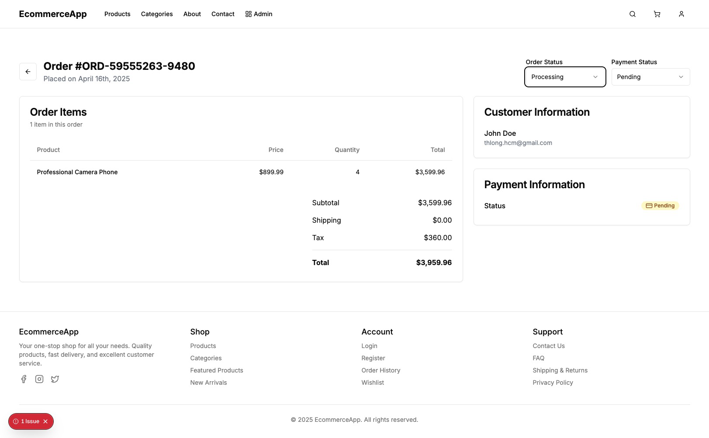

**Title**: Implement order status updates

**Description**: As an admin, I want to update order status as it moves through the fulfillment process.

**Acceptance Criteria**:
- Status change dropdown
- Automated emails for status changes
- Status history tracking

> **Estimation**: 2 points

---

### (backlog) User Story 6.4: Invoice Generation

**Title**: Create invoice generation functionality

**Description**: As an admin, I want to generate and send invoices for orders.

**Acceptance Criteria**:
- PDF invoice generation
- Email invoice functionality
- Download invoice option
- Invoice template customization

> **Estimation**: 5 points

---

### (backlog) User Story 6.5: Return/Refund Processing

**Title**: Implement return and refund management

**Description**: As an admin, I want to process returns and issue refunds when necessary.

**Acceptance Criteria**:
- Return request handling
- Partial and full refund options
- Refund through payment gateway
- Return status tracking

> **Estimation**: 2 points

---

## EPIC 7: Customer Support System
**Description**: Implement comprehensive customer support features

### User Story 7.1: Contact Form

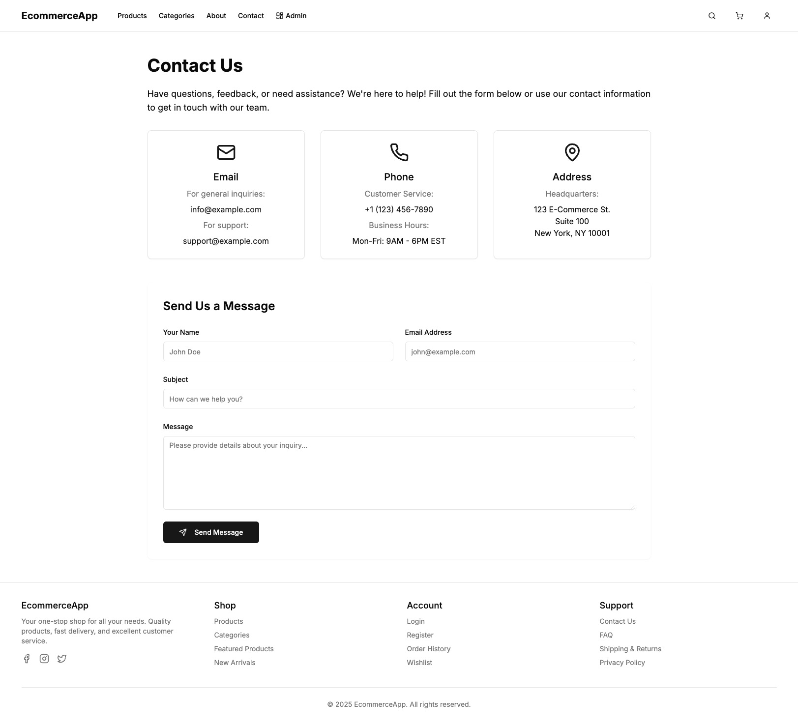

**Title**: Create contact page with form submission

**Description**: As a customer, I want to contact the store with questions or issues.

**Acceptance Criteria**:
- Contact form with fields for name, email, subject, message
- Form validation
- Success/error notifications
- Email notification to administrators

> **Estimation**: 2 points

---

### (backlog) User Story 7.2: Support Ticket System

**Title**: Implement support ticket management

**Description**: As a customer, I want to submit support tickets and track their status.

**Acceptance Criteria**:
- Ticket submission form
- Ticket listing in customer account
- Status updates and communication thread
- File attachment capability

> **Estimation**: 5 points

---

### (backlog) User Story 7.3: Admin Ticket Management

**Title**: Create admin interface for ticket handling

**Description**: As an admin, I want to manage customer support tickets efficiently.

**Acceptance Criteria**:
- Ticket listing with filtering and sorting
- Ticket assignment to staff members
- Response interface with templates
- Status change and resolution tracking
- Internal notes for staff only

> **Estimation**: 5 points

---

### User Story 7.4: FAQ System

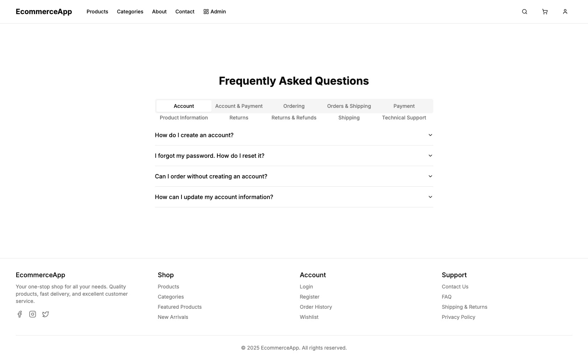

**Title**: Implement FAQ knowledge base

**Description**: As a store owner, I want to provide frequently asked questions to reduce support inquiries.

**Acceptance Criteria**:
- Categorized FAQ entries
- Search functionality
- Admin interface to add/edit FAQs
- Structured layout with expand/collapse

> **Estimation**: 2 points

---

## EPIC 8: Promotions and Marketing
**Description**: Create promotional tools and marketing features

### (backlog) User Story 8.1: Coupon Management

**Title**: Implement coupon code creation and management

**Description**: As an admin, I want to create and manage promotional coupon codes.

**Acceptance Criteria**:
- Coupon creation form with validation
- Different discount types (percentage, fixed amount)
- Usage limits and expiration
- Minimum purchase requirements
- Usage tracking and statistics

> **Estimation**: 5 points

---

### User Story 8.2: Featured Products Management

**Title**: Create featured products selection tool

**Description**: As an admin, I want to select which products appear as featured on the homepage.

**Acceptance Criteria**:
- Product selection interface
- Ordering control for featured products
- Scheduling of featured periods

> **Estimation**: 2 points

---

### (backlog) User Story 8.3: Sale Price Scheduling

**Title**: Implement scheduled sale prices for products

**Description**: As an admin, I want to schedule sale prices for products with start and end dates.

**Acceptance Criteria**:
- Sale price field in product form
- Date range picker for sale period
- Automatic price updates based on schedule
- Visual indicators for products on sale

> **Estimation**: 3 points

---

### (backlog) User Story 8.4: Related Products

**Title**: Create related products functionality

**Description**: As an admin, I want to specify related products to increase cross-selling opportunities.

**Acceptance Criteria**:
- Related product selection in product form
- Automatic suggestions based on category
- Display of related products on product page

> **Estimation**: 2 points

---

### User Story 8.5: About Page

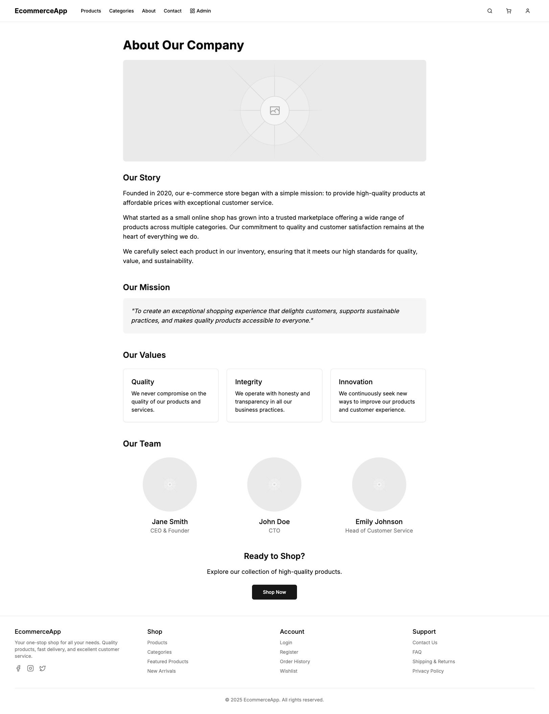

**Title**: Create company about page

**Description**: As a store owner, I want to share company information and story with customers.

**Acceptance Criteria**:
- Editable about page sections
- Team member profiles
- Company history timeline
- Mission and values statements

> **Estimation**: 2 points

---

## EPIC 9: Analytics and Reporting
**Description**: Implement comprehensive analytics and reporting tools

### User Story 9.1: Sales Dashboard

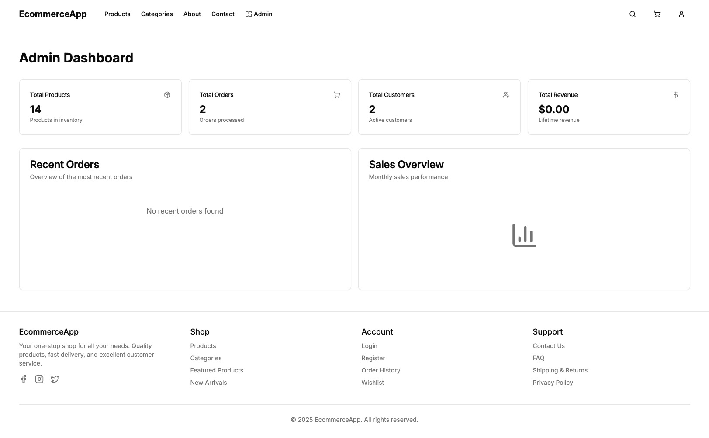

**Title**: Create admin sales dashboard

**Description**: As an admin, I want a dashboard with key sales metrics to track business performance.

**Acceptance Criteria**:
- Summary of recent sales
- Charts for daily/weekly/monthly sales
- Top selling products
- Revenue trends
- Filters for date ranges

> **Estimation**: 5 points

---

### (backlog) User Story 9.2: Inventory Reports

**Title**: Implement inventory reporting

**Description**: As an admin, I want inventory reports to manage stock levels.

**Acceptance Criteria**:
- Low stock alerts
- Out of stock reports
- Inventory value calculations
- Movement history for products

> **Estimation**: 3 points

---

### (backlog) User Story 9.3: Customer Analytics

**Title**: Create customer behavior analytics

**Description**: As an admin, I want to analyze customer behavior to improve marketing.

**Acceptance Criteria**:
- New vs returning customer metrics
- Average order value tracking
- Purchase frequency analysis
- Customer lifetime value estimates

> **Estimation**: 3 points

---

### (backlog) User Story 9.4: Export Reports

**Title**: Implement report export functionality

**Description**: As an admin, I want to export reports for further analysis.

**Acceptance Criteria**:
- CSV and PDF export options
- Customizable export fields
- Scheduled automatic exports

> **Estimation**: 2 points

---

## EPIC 10: Reviews and Ratings
**Description**: Implement product review and rating system

### (backlog) User Story 10.1: Product Reviews

**Title**: Create product review submission

**Description**: As a customer, I want to write reviews for products I've purchased.

**Acceptance Criteria**:
- Review form with text and rating
- Verification of purchase
- Photo upload option
- Success/error notifications

> **Estimation**: 3 points

---

### (backlog) User Story 10.2: Review Management

**Title**: Implement admin review moderation

**Description**: As an admin, I want to moderate customer reviews before they are published.

**Acceptance Criteria**:
- Review approval workflow
- Edit capability for inappropriate content
- Rejection with reason
- Response to review functionality

> **Estimation**: 2 points

---

### (backlog) User Story 10.3: Review Display

**Title**: Create review display on product pages

**Description**: As a customer, I want to read other customers' reviews to make informed purchase decisions.

**Acceptance Criteria**:
- Reviews section on product page
- Average rating display
- Sorting and filtering of reviews
- Pagination for many reviews
- Helpful/not helpful voting

> **Estimation**: 3 points
